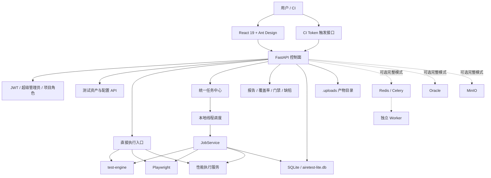
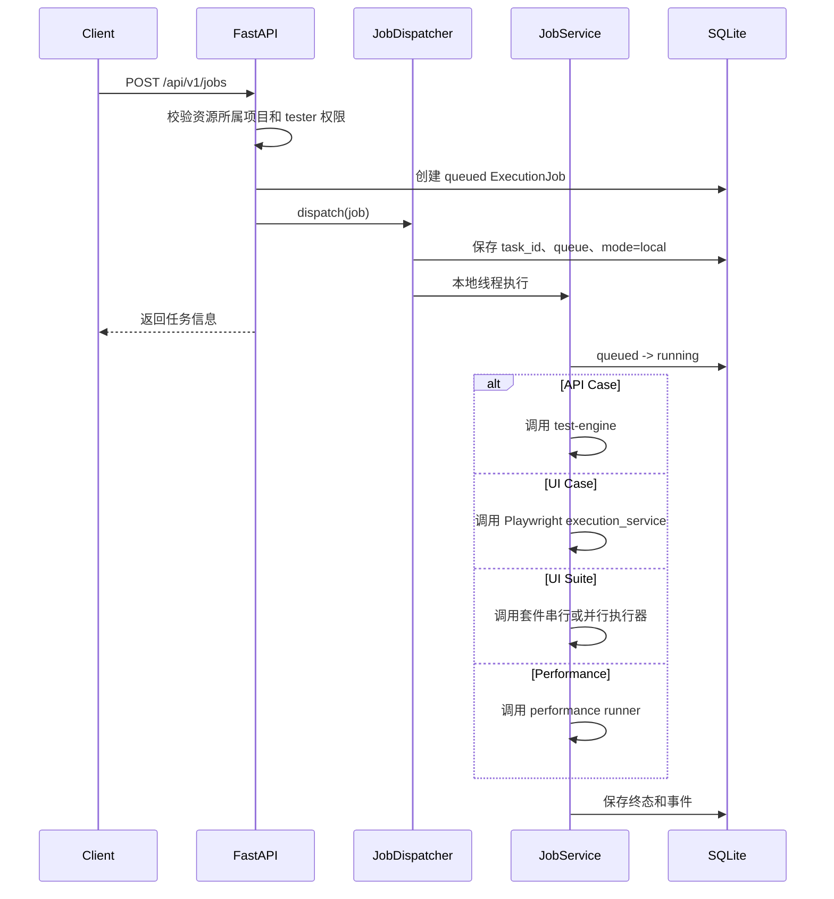

# AIRETEST 当前平台分析与建设路线

> 文档版本：v1.0  
> 分析日期：2026-07-16  
> 分析范围：`E:\xlwang\AIRETEST` 当前工作区  
> 文档定位：当前代码事实基线、个人单机建设排序和本地验收依据

---

## 1. 结论摘要

AIRETEST 当前已经不是简单的接口测试 Demo，而是一个覆盖 API、UI、性能测试、
测试资产、报告、权限、CI/CD、通知、知识和 AI 能力的综合测试平台。

从代码完成度和当前使用范围看，平台处于：

> **个人单机功能型 Beta / 本地可用性验收阶段**

主要依据：

1. 测试资产和业务功能面较完整，后端已注册 42 个路由模块、260 个 API
   操作，前端已有 40 个页面。
2. 默认 `.env` 已切换为 SQLite、Alembic 和本地线程调度；Oracle、Redis、
   Celery 和三 Worker 拓扑作为可选完整模式保留。
3. API、UI 和性能测试都有可工作的直接执行入口。
4. 统一任务中心已经接入 API、UI 用例、UI 套件和性能测试的真实执行分派，
   并统一保存状态、事件、错误和 Artifact。
5. 工作流、契约、质量门禁、缺陷同步已经建立数据模型和 API，但核心业务闭环
   仍是简化实现或未自动触发。
6. 后端自动化测试基线较强，前端已经恢复 typecheck、lint、Vitest 和生产构建。
7. 无 Docker 轻量模式已经完成 SQLite migration、后端/前端健康检查和真实
   API Case local dispatch 验收，可作为个人日常默认运行方式。

当前最重要的建设目标不是继续增加菜单，而是：

> **保持执行结果真实，并让默认轻量模式可启动、可停止、可检查、可恢复数据。**

---

## 2. 当前量化基线

| 项目 | 当前结果 |
|---|---:|
| FastAPI 路由模块 | 42 个，加载失败 0 |
| API 操作 | 260 个 |
| ORM 业务表 | 53 张 |
| 默认 SQLite 实际表 | 54 张，含 `alembic_version` |
| Alembic revision | 3 个 |
| 后端 API Python 文件 | 43 个，含 `__init__.py` |
| 后端模型 Python 文件 | 43 个，含 `__init__.py` |
| 后端 Service Python 文件 | 29 个 |
| 前端页面 | 40 个 |
| 前端 typecheck | 通过 |
| 前端 ESLint | 0 errors，740 existing warnings |
| 前端 Vitest | 5 passed |
| 前端 Vite build | 通过，2.43MB chunk warning |
| 后端全量测试 | 675 passed，38 warnings |
| 当前 Ruff 全量检查 | 109 个问题 |
| 当前 mypy 后端检查 | 224 个问题，分布于 41 个文件 |
| Git | 已初始化本地 `main` 分支，尚无初始提交 |
| 本机 Node/npm | Node 22.12.0 与 npm 10.9.0 可由本地脚本发现 |
| 默认本地模式 | SQLite + local dispatch，后端/前端健康 |
| SQLite revision | `a7d9e2c4f610` |
| 本地监听 | 仅 `127.0.0.1:8000`、`127.0.0.1:5173` |
| 可选完整模式 | `.env.oracle` + Docker/Oracle/Redis/Celery |

说明：

- 260 个 API 操作由当前应用实例实际加载后统计，不等同于源码中的装饰器数量。
- 53 张业务表由 SQLAlchemy `Base.metadata` 和 Oracle 预检清单共同确认。
- 最终全量 pytest 结果为 `675 passed, 38 warnings`。
- SQLite 的 54 张表由 53 张业务表和 `alembic_version` 组成。
- 38 个 warning 主要来自两个 ORM 类的 pytest 收集提示，以及
  `python-jose` 对 `datetime.utcnow()` 的弃用提示。
- Ruff 和 mypy 问题包含存量格式、未使用导入、类型存根缺失、旧式 SQLAlchemy
  模型类型和真实类型不一致，不能全部视为运行时缺陷，但说明静态质量门禁尚未
  建立。

---

## 3. 平台定位

AIRETEST 当前承担五类职责：

| 层级 | 职责 |
|---|---|
| 测试资产层 | 项目、环境、变量、接口、用例、计划、UI 元素、步骤、套件、压测场景 |
| 测试执行层 | API 执行、UI Playwright 执行、性能执行、定时任务、统一任务中心 |
| 结果治理层 | 报告、历史、覆盖率、性能指标、视觉回归、JUnit、任务产物 |
| 质量协作层 | 契约、质量门禁、缺陷、通知、CI/CD、审计、用例版本和评审 |
| 智能增强层 | AI 用例生成、失败分析、知识库、AI 调用治理和反馈 |

当前目标场景：

- 个人统一管理 API、UI 和性能测试资产。
- 本机手工调试、测试计划执行和定时执行。
- 测试结果、覆盖率、性能 SLA 和质量门禁管理。
- 在本机通过 SQLite `airetest-lite.db` 保存个人数据。

当前不应宣称已经具备的能力：

- 完整分布式执行平台。
- 多机横向扩容和高并发任务调度。
- 可恢复、可租约、可横向扩展的 Agent 执行。
- 生产级任意脚本隔离。
- 完整 OpenAPI 契约兼容性分析。
- 已闭环的工作流编排和自动质量门禁。

---

## 4. 当前总体架构



### 4.1 前端

技术栈：

- React 19
- TypeScript
- Vite
- Ant Design
- React Router
- Axios
- Chart.js、Recharts

当前特点：

- 页面覆盖面广，菜单已经形成 API、UI、性能、质量、知识和系统管理分组。
- 登录态通过 `AuthContext` 管理，业务页面由布局层统一做认证守卫。
- 主要 API 调用集中在 `frontend/src/services/api.ts`，模块继续扩展后会出现
  单文件职责过大的问题。
- 已有任务中心、质量门禁、缺陷和 AI 运营页面。
- 尚无工作流和契约管理页面。
- 自动化测试只有一个示例文件，无法保护 40 个页面的关键流程。

### 4.2 后端控制面

FastAPI 当前负责：

- 资源 CRUD、登录、JWT、项目权限和审计。
- 同步执行 API、UI、性能测试。
- 创建、投递、查询、取消和重试统一任务。
- 查询报告、历史、覆盖率、任务事件和产物。
- CI Token、Webhook、通知渠道和规则。
- 工作流、契约、质量门禁、缺陷和 AI 治理。

路由通过 `app.main._register_routers` 动态加载：

- 开发环境允许记录路由加载失败并继续启动。
- 非 development 环境存在路由加载失败时直接退出。
- 除认证、CI/CD 和任务 WebSocket 特殊路由外，业务路由统一注入 JWT。

### 4.3 测试引擎

独立的 `test-engine` 包负责：

- HTTP 请求构建。
- 变量替换与提取。
- 断言执行。
- 测试结果组装。

后端业务层通过 `test_engine` 调用执行能力。该拆分方向正确，但当前仓库目录名
使用 `test-engine`，需要通过打包安装映射为 `test_engine`；本地静态检查直接
扫描目录时存在包解析问题。

### 4.4 数据层

默认个人单机数据库配置为：

```text
sqlite:///./airetest-lite.db
```

数据库设计特点：

- 默认业务数据由 SQLite 保存。
- 默认任务使用 `TASK_DISPATCH_MODE=local`，不依赖 Redis。
- Alembic 管理 SQLite Schema，`AUTO_CREATE_SCHEMA=false`。
- 测试继续使用 SQLite 内存库。
- Oracle 和 Redis/Celery 作为可选完整模式保留。
- 自定义 `JSONText` 把 Python dict/list 序列化为文本，Oracle 中映射为 CLOB。
- `job_events.id` 等递增主键使用 Oracle `IDENTITY`。
- 当前共有 53 张业务表。

主要数据域：

| 数据域 | 代表表 |
|---|---|
| 用户与权限 | `users`、`roles`、`user_roles`、`projects`、`project_members` |
| API 测试 | `test_cases`、`assertion_rules`、`test_plans`、`test_plan_items` |
| UI 测试 | `ui_test_cases`、`ui_test_suites`、`ui_elements`、`ui_locators` |
| 性能测试 | `performance_tests`、`performance_results`、`perf_metrics` |
| 任务中心 | `execution_jobs`、`execution_attempts`、`job_events`、`job_artifacts` |
| 质量治理 | `contract_versions`、`quality_gates`、`defect_tickets` |
| 通知集成 | `notification_channels`、`notification_rules`、`webhook_configs` |
| AI 与知识 | `ai_invocations`、`ai_feedback`、`defect_patterns`、`business_rules` |

### 4.5 部署层

默认轻量运行由以下脚本管理：

- `scripts/start-local.ps1`
- `scripts/stop-local.ps1`
- `scripts/status-local.ps1`

脚本直接启动 Python/FastAPI 与 Node/Vite，管理 PID、日志、端口、SQLite
migration 和健康检查。默认 Artifact 位于 `.uploads`，管理员初始凭据位于
`.runtime/initial-admin.txt`。

可选完整模式由 `start-docker.ps1`、`stop-docker.ps1` 和
`status-docker.ps1` 管理，`docker-compose.yml` 定义：

- Oracle Free 23
- Redis 7
- 可选 MinIO（`object-storage` profile）
- Alembic migrate
- FastAPI backend
- React/Vite frontend
- 默认 `worker-local`，串行监听三类任务队列
- 可选 API/UI/Performance 独立 Worker（`distributed` profile）

默认轻量模式适合个人本机日常使用：

- 前端直接运行 Vite 开发服务器。
- Backend 直接运行 `backend/run_server.py`。
- `backend/run_server.py` 保留 Windows 默认 Proactor event loop，不再强制
  Selector，已修复 Windows UI 执行的 WinSock 失败根因。
- 后端和前端仅绑定 `127.0.0.1`，不向局域网网卡监听。
- SQLite 与 `.uploads` 在本机持久化。
- 私有 `.env` 使用 SQLite 和 local dispatch，并由 Git 忽略。
- Docker/Oracle/Redis 不再构成默认启动前置条件。
- 反向代理、TLS、高可用和集中日志不属于当前范围；本地备份仍需补齐。

---

## 5. 功能成熟度矩阵

评级说明：

- A：主链路完整，可进入实机验收。
- B：功能可用，但仍有部署、权限或工程缺口。
- C：模型和接口存在，核心闭环未完成。
- D：仅原型或占位。

| 领域 | 现有能力 | 评级 | 主要缺口 |
|---|---|---:|---|
| API 调试与执行 | 请求、断言、提取、Cookie、脚本、重试 | A- | local 模式已真实验收，完整模式 Worker 为可选扩展 |
| API 用例管理 | CRUD、复制、版本、评审、发布、项目隔离 | A- | 前端评审流程和覆盖测试需加强 |
| 测试计划 | 用例串联、上下文变量、项目归属 | B+ | 应迁移到统一异步任务执行 |
| 数据驱动 | CSV/JSON、变量替换、批量执行 | B+ | 大数据量任务化、产物化不足 |
| 数据库断言 | 参数绑定、SQL 安全检查、多数据库连接 | B+ | 凭证策略和隔离仍需加强 |
| UI 用例 | Playwright、步骤、重试、截图、Trace、视频 | A- | 真实浏览器本地 Runner 环境仍需扩展验收 |
| UI 套件 | 串行/并行、套件运行记录 | B+ | 并行资源限制和真实浏览器环境待验收 |
| UI 录制 | Playwright 录制、事件保存 | B | 进程内会话状态，重启和多副本不一致 |
| 视觉回归 | 基线、截图比较、差异记录 | B | Artifact 对象存储和批量治理不足 |
| 性能测试 | 场景、阶段、实时快照、SLA、服务器指标 | B+ | 真实压测本地 Runner 和资源隔离待验收 |
| 任务中心 | 四类真实执行、状态机、幂等、事件、重试、取消、Artifact | A- | local 线程随 API 重启中断，无分布式恢复 |
| 报告与历史 | API/UI/性能结果、报告导出、趋势 | B+ | SQLite 备份、清理和长期保留策略待完善 |
| 项目权限 | 五级项目角色和主要资源隔离 | A- | 需要持续执行全路由权限矩阵回归 |
| 敏感数据 | AES-256-GCM、Cookie/密码/Webhook 加密、脱敏 | B+ | 多版本密钥轮换、变量 Secret 类型不足 |
| 工作流 | DAG 定义、版本、发布、拓扑排序、运行记录 | C | 节点全部模拟成功，没有真实调度 |
| 契约测试 | OpenAPI 版本、基础差异、状态码校验 | C+ | Schema、参数、响应体兼容分析不足，无前端 |
| 质量门禁 | 规则 CRUD、手工评估、结果历史 | C+ | 未完整订阅测试任务完成事件 |
| 缺陷管理 | 缺陷票据、状态、外部系统字段 | C | 外部系统同步为占位 |
| AI 与知识 | 用例生成、失败分析、知识库、调用记录 | B- | 统一治理覆盖、评估指标和成本控制不足 |
| 前端工程 | 40 个业务页面、统一布局、任务实时日志、测试和构建 | B | E2E、模块化和错误边界仍不足 |
| 工程交付 | pytest、前端门禁、Alembic、Ruff、mypy、GitHub Actions | B | 尚未初始化 Git，Ruff 和 mypy 全量仍有存量债务 |

---

## 6. 执行链路事实

这是当前平台最需要明确的部分。

### 6.1 已有直接执行能力

| 类型 | 直接执行入口 | 实际实现 |
|---|---|---|
| API | `execution`、测试用例、测试计划等接口 | 调用 `test-engine` 真实发起请求 |
| UI Case | UI 用例运行接口 | 调用 Playwright 真实执行步骤 |
| UI Suite | UI 套件运行接口 | 支持串行或线程池并行执行 |
| Performance | 性能测试运行接口 | 后台线程执行请求和指标采集 |

这些能力说明测试功能本身并非空实现。

### 6.2 统一任务中心链路



迭代一已经消除 UI 和性能任务的占位成功：

- API Runner 调用 `test-engine`。
- UI Runner 调用 Playwright，并保存 UI 记录、截图和 Trace。
- UI Suite 支持串行或并行执行，汇总每个用例的真实结果。
- Performance Runner 调用性能执行服务并保存指标、SLA 和 JSON 报告。
- 执行器只允许返回 `succeeded`、`failed` 或 `timed_out`，其他状态按失败处理。

当前自动化测试使用 mock 隔离真实浏览器和长时间压测边界，因此仍需要在
Playwright 和受控压测目标环境完成进一步实机验收。可选完整模式再单独验证
Redis/Celery。

默认模式已经完成真实 API Case 验收：

| 类型 | Job ID | 验收证据 |
|---|---|---|
| API Case | `66c5b38b-ae6a-4a18-bc9a-4453f91eaac3` | `succeeded`，5 events |
| UI Case | `b616c144-6a52-4364-bb0f-59ff772e690c` | `succeeded`，screenshot + trace |
| UI Suite | `12d00a7e-3ee3-4eb0-b909-90fba591263c` | `succeeded`，screenshot + report |
| Performance | `dd3c4bb6-5c05-4db1-ad1b-a84d96ee81a2` | `succeeded`，3 requests/3 success，report |

API Case 的 5 个事件为 `job.created`、`job.dispatched`、`job.started`、
`job.log` 和 `job.completed`。

### 6.3 取消与超时

默认 local 模式已实现：

- queued/running 状态可以请求取消。
- 任务有幂等键、尝试次数、事件和终态约束。
- 真实执行日志和完成事件落入 SQLite。

明确限制：

- API 进程重启会中断当前进程内的运行中任务。
- local 线程没有分布式接管、租约恢复或自动重投递。
- 本地线程不能等同于独立 Worker 的进程级强制终止，但会保留取消或超时终态，
  丢弃随后到达的成功结果。
- 生产环境已禁止同步执行接口，用户脚本改在可终止子进程执行。
- 可选完整模式的 Worker 被杀死、Redis 中断、重复投递和超时恢复仍需实机验收。
- WebSocket 当前每秒轮询数据库，不是 Redis Pub/Sub 事件推送。

---

## 7. 权限与安全架构

### 7.1 已实现的认证与授权

全局认证：

- JWT 用户认证。
- 用户启用状态检查。
- 超级管理员能力。
- CI Token 单独认证和 scope 检查。
- 非公开业务路由统一注入 JWT。

项目角色：

```text
viewer < tester < developer < admin < owner
```

建议继续保持的权限语义：

| 操作 | 最低角色 |
|---|---|
| 查看列表和详情 | viewer |
| 执行测试、评估门禁 | tester |
| 创建和修改资源 | developer |
| 删除、发布、外部同步 | admin |
| 删除项目、最终所有权操作 | owner |

主要 API、UI、性能、任务、工作流、契约、门禁和缺陷资源已经接入统一项目权限
辅助函数。

### 7.2 已实现的安全能力

- CORS 显式白名单。
- URL 出站策略和 SSRF 控制。
- 响应体大小限制。
- 数据库断言使用参数绑定和 SQL 解析。
- 环境数据库密码加密。
- Cookie value 加密。
- 通知和 CI Webhook URL、Secret 加密。
- AES-256-GCM 认证加密和版本前缀。
- 请求快照、日志、审计和响应中的敏感字段脱敏。
- Artifact 直接路径默认关闭。
- 生产环境拒绝默认的加密密钥。

### 7.3 仍需处理的安全问题

| 优先级 | 问题 | 建议 |
|---|---|---|
| P0 | 用户脚本仍可由 API 进程内 `exec` 执行 | 移到独立子进程或隔离容器 |
| P0 | 同步 API/UI/性能执行仍可占用控制面资源 | 生产环境只允许任务中心执行 |
| P0 | 通知、报告、历史和部分 CI 配置缺少一致的项目边界 | 做全路由授权矩阵审计 |
| P1 | `Environment.variables` 可保存 token，但没有显式 Secret 类型 | 增加 secret value 或 Secret 引用 |
| P1 | 加密服务只能解当前单一版本密钥 | 增加 keyring、轮换和重加密任务 |
| P1 | staging 不拒绝默认密钥，JWT 默认 Secret 也缺少统一强校验 | staging/production 使用同一启动校验 |
| P1 | Compose 默认密码可直接启动 | 生产 Compose/Helm 禁止默认值 |
| P2 | WebSocket token 放在查询参数 | 改为短期 ticket 或安全 Cookie |

---

## 8. SQLite 默认数据层与可选 Oracle

### 8.1 已完成

- 默认数据库 URL 已使用 `sqlite:///./airetest-lite.db`。
- 默认 `TASK_DISPATCH_MODE=local`，不依赖 Redis/Celery。
- `AUTO_CREATE_SCHEMA=false`，Schema 由 Alembic 管理。
- SQLite migration 已完成，revision 为 `a7d9e2c4f610`，共 54 张表。
- 后端与前端只监听 `127.0.0.1:8000` 和 `127.0.0.1:5173`，健康检查通过。
- API、UI Case、UI Suite、Performance 四类 local job 全部执行成功。
- 默认 Artifact 使用 `.uploads`。
- 管理员初始凭据保存于 `.runtime/initial-admin.txt`。

可选 Oracle 完整模式仍已具备：

- Alembic 包含 53 张表的 Oracle 完整基线。
- TestPlan 项目归属有后续 revision。
- JSONText 在 Oracle 中使用 CLOB。
- 提供 SQLite 到 Oracle 数据迁移脚本。
- 提供 Oracle 上线预检：
  - 连接
  - Alembic head
  - 53 张表
  - CLOB 类型
  - JSON 往返
  - IDENTITY
  - 事务回滚无残留

### 8.2 可选完整模式的外部验收

以下项目只影响可选 Oracle/Docker 完整模式，不阻塞默认轻量使用：

- Oracle Free 23 容器能否完整启动。
- `alembic upgrade head` 能否在目标 Oracle 版本成功执行。
- 53 张表、索引、外键和 CLOB 是否全部正确。
- SQLite 现有数据迁移到 Oracle 后的行数、中文、时间和空值一致性。
- 连接池断线恢复。
- Oracle 与三个 Celery Worker 并发读写行为。
- 生产备份、恢复、Schema 权限和容量策略。

### 8.3 数据层建议

1. 默认个人模式以 SQLite 为业务事实库。
2. 所有新表和字段只能通过 Alembic 变更。
3. 默认 Artifact 使用 `.uploads`；大型报告、视频和 Trace 需要本地清理策略。
4. 任务事件需要归档和保留策略，避免 `job_events` 无限增长。
5. 启用完整模式时，Oracle 保存业务事实，Redis Result Backend 不能替代最终
   任务状态。

---

## 9. 前端现状

### 9.1 已有页面

主要页面已经覆盖：

- 仪表盘、任务中心。
- API 定义、文档、调试、用例、计划、数据、导入和 Mock。
- UI 用例、套件、步骤库、元素库、记录和日志。
- 性能场景、报告和实时看板。
- 报告、覆盖率、门禁、缺陷和历史。
- 项目、环境、变量、定时任务。
- AI 助手、AI 运营和知识工程。
- 用户、角色、Token、CI/CD、通知和审计。

### 9.2 缺口

- 没有工作流管理页面。
- 没有契约版本、差异和校验页面。
- 项目成员管理体验仍需完善。
- 任务中心需要展示真实实时日志、产物、取消结果和重试关系。
- 缺少统一请求缓存、错误边界、全局加载和接口错误规范。
- `api.ts` 应按领域拆分，避免继续集中扩展。
- 当前有 2 个测试文件、5 个通过用例，覆盖任务中心关键交互。
- TypeScript typecheck 通过。
- ESLint 为 0 errors、740 existing warnings。
- Vite 生产构建通过，存在 2.43MB chunk warning。

### 9.3 前端质量最低要求

1. Vitest 覆盖权限守卫、API 封装和关键表单。
2. Playwright E2E 覆盖登录、创建项目、创建用例、提交任务、查看报告。
3. 每个页面至少具备 loading、empty、error 和 forbidden 状态。
4. 所有列表分页、筛选和项目切换行为保持一致。
5. 前端构建必须成为 CI 合并门禁。

---

## 10. 工程质量现状

### 10.1 优势

- 后端自动化测试数量较多，本次完整基线为 675 passed。
- 安全、权限、Oracle 兼容和任务中心已有定向测试。
- Ruff、mypy、pytest、Alembic 都有配置。
- `test-engine` 与业务 API 已做代码边界拆分。
- 配置项集中在 Pydantic Settings。

### 10.2 主要问题

- 当前目录不是 Git 仓库，无法进行分支、评审、回滚和版本追踪。
- 没有 CI 合并门禁。
- Ruff 全量仍有 109 个问题。
- mypy 后端仍有 224 个问题。
- 部分 mypy 问题来自缺少依赖类型存根和 `test_engine` 安装方式，但仍有真实
  Optional、响应模型和 SQLAlchemy 类型问题。
- 前端自动化测试仍只覆盖任务中心和示例逻辑，关键业务 E2E 尚未建立。
- 本地脚本可发现 Node/npm；Docker 仅为可选完整模式依赖。
- 全量 pytest 耗时为 119.44 秒，需要在 CI 中继续做分层和耗时分析。
- 现有文档中的部分目标架构仍写 PostgreSQL 或把 Oracle 当作默认数据库，后续
  应统一为 SQLite 默认、Oracle 可选完整模式。

---

## 11. 最高优先级问题

### P0：阻止错误结果和本机不可用风险

| 编号 | 任务 | 状态 | 完成标准 |
|---|---|---|---|
| P0-01 | UI Case 任务接入真实 Playwright Runner | 本地完成 | Worker 产生真实 UI 记录、日志和产物 |
| P0-02 | UI Suite 任务接入真实套件 Runner | 本地完成 | 串行/并行结果正确汇总，失败不会被标记成功 |
| P0-03 | Performance 任务接入真实执行器 | 本地完成 | Worker 产生真实性能结果、实时指标和 SLA |
| P0-04 | 移除生产环境 API 进程内脚本执行 | 已完成 | 脚本在可终止子进程运行 |
| P0-05 | 统一所有执行入口 | 已完成生产守卫 | 生产环境同步执行接口关闭 |
| P0-06 | 完成剩余项目权限审计 | 已完成 | 通知、CI、报告、历史不能跨项目读取或修改 |
| P0-07 | 完成默认 SQLite/local 单机验收 | 已完成 | migration、健康检查和四类真实任务成功 |
| P0-08 | 建立本地 Git 基线 | 仓库已初始化，待初始提交 | 可以查看和回退个人开发版本 |
| P0-09 | 可选 Oracle、Redis、Celery 实机验收 | 非默认阻塞 | 完整模式执行、取消、超时和重启通过 |

### P1：形成业务闭环

| 编号 | 任务 | 完成标准 |
|---|---|---|
| P1-01 | 工作流节点真实调度 | 节点生成 Job，支持依赖、上下文、失败策略和重试 |
| P1-02 | 质量门禁自动触发 | 测试任务完成后自动评估并返回 CI 结果 |
| P1-03 | 契约测试增强 | 支持参数、请求体、响应 Schema 和 breaking change |
| P1-04 | 外部缺陷适配器 | Jira、禅道、GitLab 至少完成一个真实 provider |
| P1-05 | Artifact 生命周期 | 本地截图、视频、Trace、报告可清理、备份和恢复 |
| P1-06 | Secret 治理 | 变量 Secret 类型、多版本密钥和轮换 |
| P1-07 | 前端关键页面测试 | 核心 E2E 和领域组件测试进入 CI |

### P2：增强扩展性和运营能力

| 编号 | 任务 | 完成标准 |
|---|---|---|
| P2-01 | Redis 事件流 | 可选完整模式 WebSocket 不再每秒轮询数据库 |
| P2-02 | 可观测性 | 统一日志、Metrics、Trace 和 Worker 健康状态 |
| P2-03 | Agent | 支持内网 Agent 注册、心跳、租约和结果回传 |
| P2-04 | 分布式性能执行 | 多 Worker/Locust Master-Worker 调度 |
| P2-05 | AI 评估闭环 | 记录模型、Prompt、成本、采纳率和回归效果 |
| P2-06 | 数据生命周期 | 任务事件、日志、报告和 Artifact 清理归档 |

---

## 12. 推荐开发路线

### 迭代一：执行真实性和个人单机底座

建议周期：2 周。

目标：

- 任何成功结果都对应真实执行。
- 默认模式不依赖 Docker 或外部基础设施。
- SQLite migration、本地进程和 Artifact 可重复管理。

工作包：

1. 抽取 API、UI Case、UI Suite、Performance 四类统一 Runner Adapter。
2. 修改 `JobService._run()`，按任务类型调用真实 Adapter。
3. 把直接执行接口改成 Job 创建兼容层。
4. 统一产物、日志、错误码、超时和取消语义。
5. 运行 SQLite/local、Playwright 和性能执行集成测试。
6. 建立 PID、日志、健康检查和一键启停脚本。

退出条件：

- 四类任务都有真实执行证据。
- 取消运行中的 UI 和性能任务可以终止实际进程。
- 默认 SQLite migration、后端和前端健康。
- 四类 local job 均为 `succeeded`，产物和 API Case 事件链完整。

### 迭代二：质量闭环

建议周期：2 至 3 周。

目标：

- 从测试资产、执行、报告到门禁和缺陷形成完整链路。

工作包：

1. 工作流节点转为统一 Job 调度。
2. Job 完成事件自动评估质量门禁。
3. CI 触发返回门禁结果和可追踪报告链接。
4. 契约差异增强，并增加契约前端。
5. 实现一个真实缺陷系统 Provider。
6. 完成本地 Artifact 清理、备份和恢复。

退出条件：

- CI 可以触发工作流并等待质量门禁结果。
- 失败任务可自动或人工创建外部缺陷。
- 契约破坏性变更可定位受影响接口和用例。

### 迭代三：工程和规模化

建议周期：2 周。

目标：

- 平台可持续迭代、可观测、可维护。

工作包：

1. 修复 Ruff 和 mypy 存量问题，启用增量强门禁。
2. 增加前端 Vitest 和 Playwright E2E。
3. 引入 Redis Pub/Sub 或 Streams 作为实时任务事件通道。
4. 增加 Prometheus 指标、结构化日志和 Trace。
5. 增加任务、日志和 Artifact 生命周期策略。
6. 修订使用手册、部署文档和开发设计中的旧数据库描述。

退出条件：

- 主分支测试、静态检查、前端构建全部通过。
- 可以定位一次任务从 API、local Runner 或可选 Worker 到目标系统的完整链路。
- 部署、升级、回滚和数据恢复流程有演练记录。

---

## 13. 建议并行开发分组

下一阶段可以按六条独立工作流并行：

| 工作流 | 负责范围 | 首要交付 |
|---|---|---|
| EXEC | 统一 Runner、UI/性能真实 Worker、取消和超时 | 四类 Job 真实执行 |
| AUTH | 通知、CI、报告、历史权限矩阵 | 全路由项目隔离报告 |
| LOCAL/OPS | SQLite、PID、日志、端口和本机健康 | 轻量模式验收报告 |
| ORA | 可选 Oracle、Alembic、数据迁移和实库验收 | Oracle 预检报告 |
| SEC | 脚本隔离、Secret 类型、密钥轮换 | 隔离执行器和 keyring 设计 |
| FE | 任务中心、工作流、契约和 E2E | 关键业务闭环页面 |
| QA/OPS | Git、CI、静态治理、Compose、监控 | 可重复发布流水线 |

共享文件冲突控制：

- `backend/app/config.py`、`backend/app/main.py`、`docker-compose.yml` 和
  `frontend/src/App.tsx` 由集成负责人统一修改。
- 数据库变更先登记 migration owner，避免并行创建冲突 revision。
- 每条工作流只修改自己的模块和测试，跨模块接口先确定协议。

---

## 14. 上线验收清单

### 数据库

- [x] 默认 SQLite migration 完成。
- [x] 默认 SQLite 后端 ready 通过。
- [ ] SQLite 备份、恢复和回滚演练完成。
- [ ] 可选 Oracle 连接、Alembic head、53 张表和预检通过。
- [ ] 可选 SQLite 到 Oracle 数据迁移完成行数和抽样核对。

### 任务执行

- [x] API Case Worker 真实执行路径和自动化测试完成。
- [x] UI Case Worker 真实执行路径和自动化测试完成。
- [x] UI Suite Worker 真实执行路径和自动化测试完成。
- [x] Performance Worker 真实执行路径和自动化测试完成。
- [x] queued 和 running 任务取消逻辑通过自动化测试。
- [x] API、UI Case、UI Suite、Performance 四类 local job 均为 `succeeded`。
- [x] API Case 产生 5 个 created/dispatched/started/log/completed 事件。
- [x] UI Case 产生 screenshot 和 trace。
- [x] UI Suite 产生 screenshot 和 report。
- [x] Performance 完成 3 requests/3 success 并产生 report。
- [ ] API 重启中断运行中 local 任务的操作提示和恢复说明完善。
- [ ] 可选完整模式的 Worker 重启、Redis 中断和重复投递有明确结果。

### 安全与权限

- [ ] staging/production 不允许默认 JWT、数据库和加密密钥。
- [ ] 脚本执行不在 API 进程内。
- [ ] 所有资源完成认证与项目权限矩阵审计。
- [ ] 数据库、Cookie、Webhook、Token 和日志中无新增明文 Secret。
- [ ] SSRF、路径穿越、越权和跨项目枚举测试通过。

### 前端

- [x] `npm run typecheck` 通过。
- [x] ESLint 0 errors，保留 740 existing warnings。
- [x] Vitest 5 passed。
- [x] Vite build 通过，保留 2.43MB chunk warning。
- [ ] 登录、创建项目、创建用例、执行任务、查看报告 E2E 通过。

### 工程与运维

- [ ] 本地 Git 创建初始提交，并能按版本回退。
- [x] pytest、Oracle 静态预检、Ruff 和前端构建可重复执行。
- [x] API、前端、PID、端口和 SQLite 状态可通过本地脚本查看。
- [ ] SQLite 与 Artifact 的本地备份、恢复和保留策略已配置。
- [x] 本地启动、停止、状态检查和故障处理文档已完成。

---

## 15. 下一步建议

迭代一的默认轻量模式已经完成本机运行验收。下一步建议：

1. 继续使用 `.\scripts\start-local.ps1`、`status-local.ps1` 和
   `stop-local.ps1` 做日常运行。
2. 备份 `airetest-lite.db`、`.uploads` 和 `.runtime/initial-admin.txt`。
3. 以 `675 passed, 38 warnings` 作为后端最终基线。
4. 扩展真实浏览器 UI Case 和 UI Suite 场景。
5. 扩展受控目标性能任务和 SLA 场景。
6. 明确 API 重启会中断 local 线程中的运行中任务，无分布式恢复。
7. 按需执行 `.env.oracle` 和 `start-docker.ps1` 的可选完整模式验收。
8. 逐步治理 ESLint 740 warnings 和 Vite 2.43MB chunk warning。
9. 配置本地 Git 作者信息并创建初始提交；远程仓库不是必需项。

本机验收通过后，再进入工作流、质量门禁、契约测试和缺陷集成闭环。
