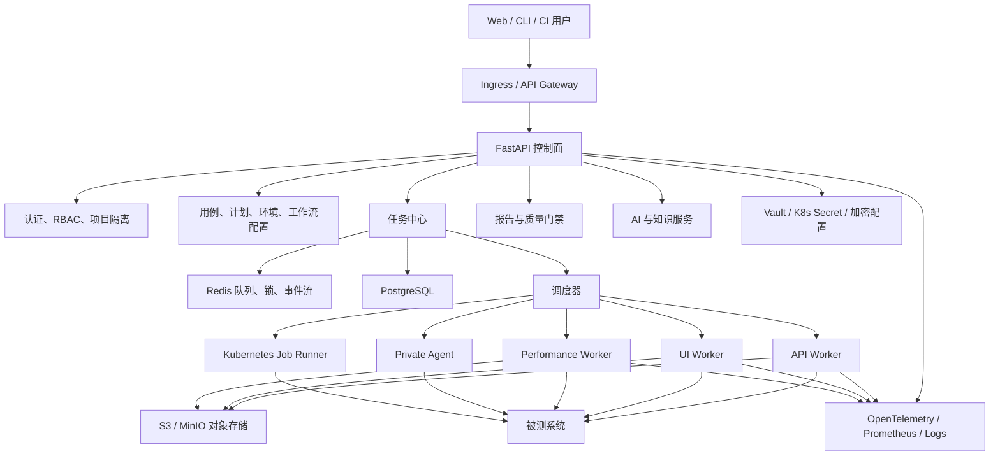
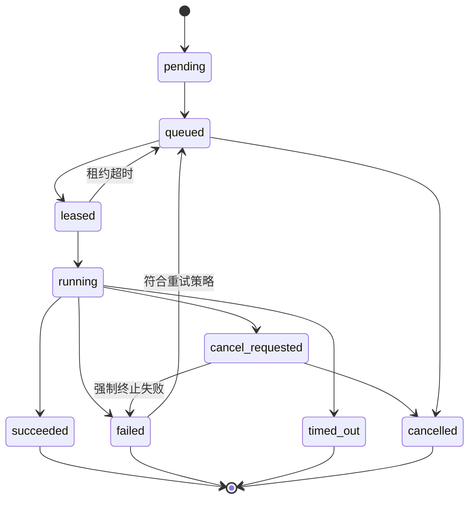
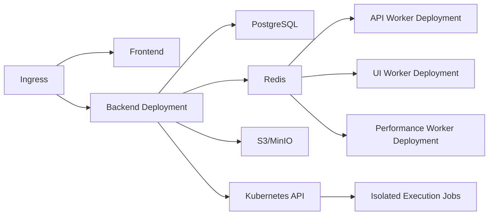

# AIRETEST 生产化改造与能力扩展开发设计

> 文档版本：v1.0  
> 编制日期：2026-07-13  
> 适用基线：当前 `AIRETEST` 工作区版本  
> 文档定位：现有《AI测试平台-开发任务拆解》之后的下一阶段开发依据

---

## 1. 文档目的

本文档用于指导 AIRETEST 从单机功能型平台升级为可在团队和生产环境中稳定使用的测试基础设施，覆盖以下内容：

1. 当前系统能力、问题和改造边界。
2. 目标技术架构与模块职责。
3. 安全、任务调度、执行隔离、数据和部署设计。
4. API、UI、性能、AI、协作等能力扩展方案。
5. 数据模型、接口协议和兼容迁移方案。
6. 可直接进入研发排期的任务拆解、依赖关系和验收标准。

本文档不替代用户使用手册。功能上线后，应同步更新：

- `AIRETEST使用手册.md`
- OpenAPI 接口文档
- 部署运维文档
- 数据库迁移说明
- 安全配置说明

---

## 2. 当前基线

### 2.1 已有能力

当前平台已经具备较完整的测试功能面：

| 领域 | 已有能力 |
|---|---|
| API 测试 | 请求构建、断言、变量提取、前置请求、脚本、重试、数据驱动、测试计划 |
| UI 测试 | Playwright 用例、录制、元素库、步骤库、套件、截图、视频、视觉回归 |
| 性能测试 | Locust 场景、实时指标、SLA、历史趋势、服务器本地指标 |
| 数据能力 | 环境、全局变量、项目、数据库断言、SQLite/MySQL 配置 |
| AI 能力 | 用例生成、结构化用例、断言推荐、失败分析、规则降级 |
| 知识工程 | 缺陷模式、业务规则、接口知识、自进化闭环 |
| 工程集成 | 用户、角色、API Token、CI/CD、通知、JUnit、报告导出 |

### 2.2 当前验证结果

| 检查项 | 结果 |
|---|---|
| Python 语法编译 | 通过 |
| 测试执行引擎 | 97 个测试全部通过 |
| 排除收集阻塞项后的测试 | 468 通过，10 失败 |
| 全量测试收集 | 被缺少 `rich` 和过期 `ServerConfig` 测试阻断 |
| 后端路由加载 | 33 个业务路由模块加载成功 |
| 前端构建 | 当前机器缺少 Node/npm，未完成验证 |
| Git 状态 | 当前目录不是 Git 工作区，无法验证提交历史 |

### 2.3 主要差距

| 优先级 | 差距 | 影响 |
|---|---|---|
| P0 | 业务 API 缺少统一后端鉴权 | 未授权读取、修改和执行测试资源 |
| P0 | 脚本、HTTP、UI 测试在 API 进程内执行 | SSRF、资源耗尽、进程阻塞和代码执行风险 |
| P0 | UI 用例允许使用服务器原始文件路径 | 本地文件泄露和任意路径写入风险 |
| P0 | Token、Cookie、数据库密码和通知 Secret 明文存储或返回 | 凭证泄露 |
| P1 | 后台任务依赖守护线程和进程内字典 | 重启丢失、多进程不一致、无法横向扩展 |
| P1 | SQLite、`create_all` 和零散迁移脚本并存 | 数据库版本不可控 |
| P1 | 测试基线不是全绿 | 变更质量无法判断 |
| P1 | 前端没有自动化测试、Lint 和严格质量门禁 | 回归风险高 |
| P2 | UI 和后端部分文件超过 1000 行 | 维护和测试成本高 |
| P2 | `{{var}}` 与 `${var}` 两套变量语法并存 | 用户认知和执行行为不一致 |

---

## 3. 建设目标

### 3.1 业务目标

1. 支持多个团队在同一平台安全管理测试资产。
2. 支持 API、UI、性能任务统一排队、调度、取消和追踪。
3. 支持在内网、隔离网络和 Kubernetes 环境执行测试。
4. 支持从需求、接口契约到用例、执行、报告和缺陷的完整追踪。
5. 支持以质量门禁方式接入 CI/CD，而不只是被动触发测试。
6. 形成 AI 生成、人工审核、执行反馈和知识沉淀的可评估闭环。

### 3.2 技术目标

| 指标 | 目标 |
|---|---|
| API 鉴权覆盖率 | 100%，除健康检查、登录和显式公开 Mock 外 |
| 敏感字段明文响应 | 0 |
| API 请求进程内执行用户脚本 | 0 |
| 执行任务可追踪率 | 100% |
| 任务取消生效时间 | API/UI 任务 10 秒内，性能任务 30 秒内 |
| 服务重启后的任务状态恢复 | 支持 |
| 后端自动化测试 | 全绿，核心模块覆盖率不低于 80% |
| 前端关键流程测试 | 登录、用例编辑、任务执行、报告查看均有覆盖 |
| 数据库迁移 | 全部由 Alembic 管理 |
| 生产部署 | 支持 Kubernetes 多副本 |

### 3.3 非目标

以下内容不在首轮生产化改造中实现：

- 自研完整浏览器云或设备云。
- 自研通用工作流引擎替代成熟队列和 Kubernetes。
- 在平台内实现任意语言脚本执行环境。
- 首期支持所有消息中间件和所有数据库类型。
- 在没有人工审核的情况下自动修改生产用例。

---

## 4. 设计原则

1. **控制面与执行面分离**：FastAPI 负责配置、鉴权和调度，不直接运行高风险任务。
2. **默认拒绝**：网络、文件、密钥和权限均按最小权限开放。
3. **任务状态持久化**：Redis 用于队列和短期状态，PostgreSQL 是最终事实来源。
4. **执行器可替换**：统一 Runner 接口，支持本地进程、Celery Worker、Agent 和 Kubernetes Job。
5. **兼容迁移**：保留现有 API 的兼容层，逐步切换异步执行。
6. **结构化数据优先**：用数据模型和解析器处理请求、SQL、工作流和协议，不使用字符串拼接。
7. **可观测性内建**：日志、指标、Trace、审计记录和任务事件在设计阶段纳入。
8. **AI 可评估、可回滚**：AI 输出必须记录模型、Prompt、版本、成本和人工反馈。

---

## 5. 目标总体架构



### 5.1 控制面

控制面继续使用 FastAPI，主要职责：

- 用户认证、权限检查和资源归属校验。
- 测试资产 CRUD。
- 创建任务、查询状态、取消任务。
- 调度策略计算。
- 报告查询和质量门禁。
- Agent 注册、心跳和任务租约。
- AI 调用和知识检索。

控制面不得承担：

- 执行用户脚本。
- 长时间运行 Playwright。
- 启动 Locust 并等待完成。
- 访问用户提供的任意服务器文件路径。
- 在请求线程内进行长时间重试。

### 5.2 执行面

执行面由以下组件组成：

| 组件 | 职责 |
|---|---|
| API Worker | HTTP、GraphQL、契约、数据驱动、场景链执行 |
| UI Worker | Playwright 浏览器任务、视频、Trace、截图、视觉回归 |
| Performance Worker | Locust 场景生成、进程管理、指标采集 |
| Agent | 在客户内网或隔离环境主动拉取并执行任务 |
| Kubernetes Job Runner | 对高风险或高资源任务按任务创建隔离 Pod |

统一抽象：

```python
class ExecutionRunner(Protocol):
    def submit(self, job: ExecutionJobSpec) -> RunnerHandle: ...
    def cancel(self, handle: RunnerHandle) -> None: ...
    def status(self, handle: RunnerHandle) -> RunnerStatus: ...
    def collect(self, handle: RunnerHandle) -> ExecutionArtifacts: ...
```

首期实现：

1. `LocalProcessRunner`：开发环境兼容模式。
2. `CeleryRunner`：默认生产任务执行。
3. `KubernetesJobRunner`：UI、性能和脚本任务隔离。

### 5.3 数据面

| 存储 | 用途 |
|---|---|
| PostgreSQL | 用户、项目、用例、任务、结果、审计、知识和配置元数据 |
| Redis | 队列、分布式锁、短期缓存、任务事件和实时指标 |
| S3/MinIO | 截图、视频、Trace、HAR、报告、日志压缩包和大文件 |
| Vault/K8s Secret | 主密钥、数据库凭证、第三方 Token |

---

## 6. 后端模块设计

### 6.1 建议目录结构

在保留当前 `api/models/schemas/services` 结构的前提下，新增任务和基础设施边界：

```text
backend/app/
├── api/v1/
├── models/
├── schemas/
├── services/
│   ├── execution/
│   │   ├── job_service.py
│   │   ├── scheduler_service.py
│   │   └── artifact_service.py
│   ├── security/
│   │   ├── secret_service.py
│   │   ├── audit_service.py
│   │   └── url_policy.py
│   └── workflows/
├── tasks/
│   ├── celery_app.py
│   ├── api_tasks.py
│   ├── ui_tasks.py
│   └── performance_tasks.py
├── runners/
│   ├── base.py
│   ├── local_process.py
│   └── kubernetes_job.py
├── repositories/
├── integrations/
├── observability/
└── migrations/
```

独立执行包建议将当前 `test-engine` 重命名为可导入的 Python 包，例如：

```text
packages/airetest_engine/
```

迁移完成后移除运行时 `sys.path.insert` 和裸 `from executor import ...`。

### 6.2 服务分层约定

| 层 | 允许职责 | 禁止职责 |
|---|---|---|
| API Route | 参数解析、依赖注入、权限声明、返回响应 | 直接执行测试和复杂数据库逻辑 |
| Service | 业务流程、事务边界、调度和权限后的资源操作 | 拼接 SQL、依赖 HTTP 请求上下文 |
| Repository | ORM 查询和数据持久化 | 执行业务策略 |
| Runner/Task | 执行测试、上传产物、上报事件 | 修改控制面配置 |
| Integration | 第三方系统适配 | 泄漏第三方响应结构到业务层 |

---

## 7. 统一任务中心设计

### 7.1 任务类型

```text
api_case
api_plan
api_workflow
data_driven
ui_case
ui_suite
performance
contract
mock_validation
ai_generation
report_export
```

### 7.2 状态机



### 7.3 核心数据模型

#### ExecutionJob

| 字段 | 类型 | 说明 |
|---|---|---|
| id | UUID | 任务 ID |
| workspace_id | UUID | 工作空间 |
| project_id | UUID | 项目 |
| job_type | String | 任务类型 |
| resource_type | String | 来源资源类型 |
| resource_id | UUID | 来源资源 ID |
| status | String | 当前状态 |
| priority | Integer | 队列优先级 |
| request_snapshot | JSONB | 执行时配置快照 |
| environment_snapshot | JSONB | 脱敏后的环境快照 |
| created_by | UUID | 创建人 |
| assigned_worker_id | UUID | 执行节点 |
| idempotency_key | String | 幂等键 |
| timeout_seconds | Integer | 总超时 |
| max_attempts | Integer | 最大尝试次数 |
| queued_at/started_at/finished_at | DateTime | 时间字段 |
| result_summary | JSONB | 结果摘要 |
| error_code/error_message | String/Text | 错误信息 |

#### ExecutionAttempt

| 字段 | 类型 | 说明 |
|---|---|---|
| id | UUID | 尝试 ID |
| job_id | UUID | 所属任务 |
| attempt_no | Integer | 第几次尝试 |
| worker_id | UUID | 执行节点 |
| runner_type | String | local/celery/kubernetes/agent |
| status | String | 尝试状态 |
| heartbeat_at | DateTime | 心跳 |
| exit_code | Integer | 退出码 |
| metrics | JSONB | 资源和执行指标 |
| started_at/finished_at | DateTime | 时间字段 |

#### JobEvent

| 字段 | 类型 | 说明 |
|---|---|---|
| id | BigInteger | 递增事件 ID |
| job_id | UUID | 任务 |
| event_type | String | status/log/progress/artifact/metric |
| sequence | Integer | 顺序号 |
| payload | JSONB | 事件内容 |
| created_at | DateTime | 创建时间 |

### 7.4 任务 API 草案

| 方法 | 路径 | 说明 |
|---|---|---|
| POST | `/api/v1/jobs` | 创建统一执行任务 |
| GET | `/api/v1/jobs` | 分页查询任务 |
| GET | `/api/v1/jobs/{id}` | 查询详情 |
| POST | `/api/v1/jobs/{id}/cancel` | 请求取消 |
| POST | `/api/v1/jobs/{id}/retry` | 手动重试 |
| GET | `/api/v1/jobs/{id}/events` | 增量查询事件 |
| GET | `/api/v1/jobs/{id}/artifacts` | 查询产物 |
| WS | `/api/v1/jobs/{id}/stream` | 实时日志和状态 |

兼容现有接口：

- `/execution/run` 可以在过渡期支持 `mode=sync|async`。
- 生产环境默认 `async`。
- 同步模式仅允许管理员在开发环境开启。

### 7.5 幂等和并发控制

1. 创建任务支持 `Idempotency-Key` 请求头。
2. 相同项目、资源和幂等键只创建一个任务。
3. 场景级并发限制由项目配置决定。
4. 性能任务默认同一场景仅允许一个运行实例。
5. 任务抢占通过 Redis 分布式锁和数据库状态条件更新实现。
6. Worker 必须定期续租，超时任务重新入队或标记失败。

---

## 8. Worker 与 Agent 设计

### 8.1 Worker

Worker 使用 Celery 5 和 Redis Broker。任务结果最终写入 PostgreSQL，不使用 Celery Result Backend 作为最终数据源。

队列建议：

```text
airetest.api
airetest.ui
airetest.performance
airetest.ai
airetest.export
```

每类 Worker 独立部署和扩容，防止 UI 或性能任务耗尽 API 测试资源。

### 8.2 Private Agent

Agent 用于执行平台无法直接访问的内网任务。

核心流程：

1. 管理员创建 Agent 注册令牌。
2. Agent 使用一次性令牌完成注册并换取短期凭证。
3. Agent 主动向平台发送心跳和能力信息。
4. Agent 通过长轮询申请任务租约。
5. Agent 执行任务并流式上报事件。
6. 产物使用预签名 URL 上传对象存储。
7. 完成后提交结果并释放租约。

Agent 能力标签：

```json
{
  "os": "linux",
  "arch": "amd64",
  "browsers": ["chromium", "firefox"],
  "capabilities": ["api", "ui", "performance"],
  "network_zone": "staging-internal",
  "labels": {
    "region": "cn-east",
    "team": "payment"
  }
}
```

调度约束：

- 项目可绑定允许使用的 Agent 池。
- 任务可指定 `network_zone` 和标签选择器。
- Agent 不能获取其他项目的任务。
- Agent 凭证支持吊销和轮换。

---

## 9. 安全设计

### 9.1 认证与授权

#### 全局权限

```text
system:user_manage
system:role_manage
system:agent_manage
system:settings_manage
system:audit_read
```

#### 项目权限

```text
project:read
project:manage
case:read
case:write
case:execute
plan:execute
environment:read
environment:manage
secret:use
secret:manage
report:read
job:cancel
performance:execute
```

实施要求：

1. 所有资源表增加 `workspace_id` 或明确的项目归属关系。
2. 所有查询必须附带资源范围过滤。
3. 管理 API Token 需要 `system` 或项目管理员权限。
4. 前端统一 Axios 客户端附加 JWT。
5. 401 自动刷新令牌或退出，403 显示无权限状态。
6. CI Token 仅使用最小 Scope，不能调用管理 API。

### 9.2 Secret 管理

Secret 类型：

```text
database_password
api_token
cookie
notification_secret
ssh_private_key
llm_api_key
custom
```

存储要求：

- 数据库存储密文、密钥版本、最后四位和元数据。
- 主密钥从 Vault、Kubernetes Secret 或环境变量注入。
- 使用 AES-GCM 等带认证的加密方式。
- API Token 使用随机明文加 HMAC-SHA256 哈希存储，明文仅创建时返回一次。
- 日志、异常和任务快照必须经过脱敏器。
- 前端不能再次读取完整 Secret，只能更新或引用 Secret ID。

### 9.3 出站网络策略

所有 HTTP、UI、Webhook、OpenAPI 导入和 Mock 转发请求统一通过 `URLPolicy`：

1. 仅允许 `http` 和 `https`。
2. 默认拒绝 loopback、link-local、multicast 和云元数据地址。
3. 私网地址需要环境或项目显式授权。
4. 支持域名和 CIDR 白名单。
5. DNS 解析后再次校验实际 IP，降低 DNS Rebinding 风险。
6. 限制重定向次数，并对每次重定向重新校验。
7. Webhook 与被测系统使用不同的访问策略。
8. Kubernetes 通过 NetworkPolicy 做第二层出站限制。

### 9.4 脚本执行

当前进程内 `exec` 必须废弃。目标方案：

- 用户脚本在独立容器或受限子进程中执行。
- 只暴露受控 SDK：变量读写、时间、随机数、加密摘要和结构化日志。
- 默认禁止网络、文件系统、进程、导入和系统调用。
- 根文件系统只读，临时目录有容量限制。
- 配置 CPU、内存、进程数和执行时间限制。
- 超时后强制终止整个执行单元。
- 脚本输出和变量变更使用 JSON 协议返回。

首期可以提供两种模式：

1. 安全表达式模式，覆盖变量计算和简单逻辑。
2. 隔离 Python 模式，仅管理员可启用。

### 9.5 文件安全

UI 用例不得继续接收服务器绝对路径。

替代设计：

- 上传文件先进入对象存储并生成 `artifact_id`。
- UI 步骤引用 `artifact_id`，Worker 下载到任务沙箱。
- 下载步骤只写入沙箱目录，结束后上传为产物。
- 文件名由平台规范化，禁止 `..`、绝对路径和设备路径。
- 单文件和任务总文件大小可配置。
- 产物支持过期和生命周期清理。

### 9.6 数据库断言

1. 数据库凭证只通过 Secret 引用。
2. 推荐使用只读数据库账号。
3. SQL 使用 SQL Parser 解析为 AST，不再只检查字符串前缀。
4. 禁止多语句、DDL、DML、文件函数和高风险存储过程。
5. 变量通过参数绑定，不使用字符串替换。
6. 限制返回行数、执行时间和结果大小。
7. 查询日志记录执行人、环境、模板和耗时，但不记录敏感结果。

### 9.7 审计

新增 `AuditLog`：

| 字段 | 说明 |
|---|---|
| actor_id | 操作人 |
| action | 创建、修改、执行、取消、导出、读取 Secret 等 |
| resource_type/resource_id | 资源 |
| workspace_id/project_id | 数据范围 |
| request_id | 请求链路 ID |
| source_ip/user_agent | 来源 |
| before/after | 脱敏差异 |
| result | success/failed |
| created_at | 时间 |

---

## 10. 数据库与迁移设计

### 10.1 数据库选型

| 环境 | 数据库 |
|---|---|
| 单元测试 | SQLite 内存数据库 |
| 本地快速演示 | SQLite，可选 |
| 标准开发环境 | PostgreSQL |
| 测试和生产 | PostgreSQL 高可用实例 |

SQLite 不再作为多人或生产环境支持目标。

### 10.2 Alembic

实施要求：

1. 初始化标准 Alembic 目录。
2. 为当前数据库状态生成基线迁移。
3. 将现有 `migrate_*.py` 和 `migrations/add_*.py` 转换为版本迁移。
4. CI 中执行空库升级和历史库升级测试。
5. 应用启动不再自动 `create_all`。
6. 启动时检测数据库版本，不匹配则 readiness 失败。

### 10.3 新增核心表

```text
workspaces
workspace_members
project_members
execution_jobs
execution_attempts
job_events
job_artifacts
worker_nodes
agent_tokens
secret_records
audit_logs
workflow_definitions
workflow_versions
workflow_runs
quality_gates
quality_gate_results
contract_versions
contract_diffs
ai_invocations
ai_feedback
```

### 10.4 大字段迁移

以下内容从数据库 JSON/Text 迁移至对象存储：

- UI 视频和 Trace。
- 大型截图和视觉差异图。
- HAR 文件。
- 完整请求/响应大文本。
- HTML、JUnit、Allure 和 PDF 报告。
- 性能测试明细和长时间序列。

数据库保留对象存储 Key、校验和、大小、类型和过期时间。

---

## 11. 功能扩展设计

### 11.1 场景工作流

目标：将当前测试计划顺序执行升级为可视化 DAG。

节点类型：

```text
api_case
ui_case
db_assertion
script
condition
parallel
loop
wait
manual_approval
sub_workflow
notification
```

能力：

- 条件分支、并行、循环、超时和失败补偿。
- Setup、Teardown 和 Always Run 节点。
- 工作流版本化和发布。
- 节点输入输出 Schema。
- 运行时上下文查看和变量溯源。
- 子工作流复用。

变量语法统一为 `{{variable}}`。迁移期继续兼容 `${variable}`，保存时自动转换并提示。

验收场景：

```text
登录 -> 并行创建订单和优惠券 -> 条件判断 -> 支付 -> DB 校验 -> 清理数据
```

### 11.2 契约测试

能力：

- 导入和版本化 OpenAPI。
- 请求、响应和状态码 Schema 校验。
- 新旧契约差异对比。
- 识别删除字段、类型变化、必填变化等破坏性变更。
- 根据变更定位受影响用例。
- CI 质量门禁。

新增 API：

```text
POST /api/v1/contracts
POST /api/v1/contracts/{id}/versions
GET  /api/v1/contracts/{id}/diff
POST /api/v1/contracts/{id}/validate
```

### 11.3 参数组合与 Fuzz

首期：

- 边界值、等价类、空值、超长值。
- Pairwise 参数组合。
- OpenAPI Schema 驱动数据生成。
- 可配置最大生成数量和随机种子。

后续：

- 基于属性的测试。
- 安全 Fuzz 字典。
- 失败样本最小化和回放。

所有自动生成请求必须遵循 URLPolicy、速率限制和环境授权。

### 11.4 协议扩展

建议顺序：

1. WebSocket。
2. SSE。
3. gRPC Unary。
4. Kafka/RabbitMQ 消息发布与消费断言。
5. gRPC Streaming 和 GraphQL Subscription。

每个协议实现统一接口：

```python
class ProtocolExecutor(Protocol):
    def validate(self, definition: dict) -> None: ...
    def execute(self, context: ExecutionContext) -> ProtocolResult: ...
```

### 11.5 Mock 与故障注入

扩展能力：

- 动态响应模板。
- 请求字段匹配和优先级。
- 状态化场景。
- 调用次数和时序约束。
- 延迟、超时、断连、随机错误和限流。
- 请求转发与录制回放。
- Mock 契约验证。

生产要求：

- Mock 服务独立部署。
- 项目级域名和路由隔离。
- 默认禁止转发到未授权地址。
- 记录调用日志和匹配规则。

### 11.6 UI 测试增强

#### 执行能力

- Playwright Trace Viewer。
- 浏览器、分辨率和设备矩阵。
- Storage State 安全复用。
- 网络拦截和 API Mock。
- Console、Page Error、Network Error 聚合。
- 失败步骤 DOM 快照。

#### 元素定位

- 定位器版本和使用统计。
- CSS、Role、Text、Test ID 等多定位器候选。
- 自动修复只生成建议，不直接覆盖已发布用例。
- 修复建议必须展示新旧差异和验证结果。

#### 代码改造

将当前 UI 路由拆分：

```text
api/v1/ui_test_cases.py
services/ui/execution_service.py
services/ui/recording_service.py
services/ui/locator_service.py
services/ui/artifact_service.py
runners/playwright_runner.py
```

### 11.7 视觉回归

- 基线版本化和审核。
- 浏览器、设备和环境独立基线。
- 动态区域遮罩。
- 像素、结构感知和阈值策略。
- 批量接受、拒绝和重新生成基线。
- 差异结果关联缺陷。
- 基线变更审计。

### 11.8 分布式性能测试

- Locust Master/Worker 或 Kubernetes Job。
- 动态并发调整。
- 主动停止和超时强制终止。
- 压测节点自动扩缩容。
- 容量基线和版本对比。
- 应用指标、服务器指标和接口指标时间线对齐。
- SLA、资源阈值和异常区间联动。

性能任务必须与普通 Worker 分离，并设置：

- 最大并发用户。
- 最大持续时间。
- 最大 Worker 数。
- 允许压测的目标白名单。
- 项目级配额。

### 11.9 用例版本与评审

- 用例草稿、评审、发布和废弃状态。
- 版本差异和回滚。
- 用例负责人、评论和审批。
- 已发布版本执行不可被编辑中的草稿影响。
- 计划和任务记录使用的用例版本。

### 11.10 缺陷与需求集成

优先支持：

- Jira。
- 禅道。
- GitLab Issue。
- Azure DevOps Work Item。

能力：

- 失败结果一键创建缺陷。
- 需求、接口、用例、执行、报告和缺陷双向关联。
- 缺陷状态回写。
- 重复缺陷识别。

### 11.11 质量门禁

门禁条件：

```text
pass_rate >= 98%
critical_failed == 0
new_failed == 0
api_coverage >= 90%
p95 <= threshold
error_rate <= threshold
contract_breaking_changes == 0
```

门禁支持：

- 项目默认规则。
- 分支和环境覆盖规则。
- 阻断、警告和仅记录模式。
- GitHub/GitLab/Jenkins 状态回写。
- 门禁结果可审计。

### 11.12 AI 与知识增强

#### RAG

检索数据源：

- 历史用例。
- OpenAPI 契约。
- 缺陷模式。
- 业务规则。
- 接口知识。
- 历史失败分析和人工结论。

#### AI 调用治理

新增 `AIInvocation`：

| 字段 | 说明 |
|---|---|
| model/provider | 模型与提供方 |
| prompt_version | Prompt 版本 |
| input_hash | 输入摘要 |
| token_usage | Token 使用量 |
| latency | 调用耗时 |
| cost | 成本 |
| output_schema_valid | 结构校验结果 |
| accepted/edited/rejected | 人工反馈 |

#### 能力扩展

- 需求到测试点和用例生成。
- 用例重复检测和覆盖缺口分析。
- Flaky Test 判断。
- 变更影响分析。
- UI 定位器修复建议。
- 失败聚类和缺陷关联。

AI 输出必须通过 Pydantic/JSON Schema 校验，并在写入正式资产前经过人工确认。

---

## 12. 前端架构设计

### 12.1 目录调整

将按页面堆叠的结构逐步改为按业务功能组织：

```text
frontend/src/
├── app/
│   ├── router.tsx
│   ├── providers.tsx
│   └── permissions.ts
├── features/
│   ├── auth/
│   ├── projects/
│   ├── cases/
│   ├── workflows/
│   ├── jobs/
│   ├── reports/
│   ├── ui-testing/
│   ├── performance/
│   └── ai/
├── shared/
│   ├── api/
│   ├── components/
│   ├── hooks/
│   ├── types/
│   └── utils/
└── pages/
```

### 12.2 API 层

1. 只保留一个基础 Axios 实例。
2. 请求拦截器统一注入 JWT、请求 ID 和工作空间 ID。
3. 统一处理 401、403、429 和标准错误响应。
4. 各 Feature 定义自己的 API Client 和 DTO。
5. 使用 OpenAPI 生成基础类型，减少手写 `any`。
6. 对 Job Stream 使用 WebSocket，并支持断线续传。

### 12.3 状态管理

建议：

- React Query 管理服务端状态。
- Context 仅保存认证和全局工作空间。
- 表单状态保留在页面或 Feature 内。
- 不在全局 Store 保存大响应、日志和图片。

### 12.4 关键新增页面

| 页面 | 功能 |
|---|---|
| 任务中心 | 队列、状态、执行人、节点、取消、重试、日志 |
| Agent 管理 | 注册、在线状态、能力、标签、版本、吊销 |
| 工作流设计器 | DAG 编排、节点配置、变量和调试 |
| Secret 管理 | 创建、更新、授权、轮换和引用关系 |
| 审计日志 | 操作人、资源、结果和差异 |
| 契约中心 | OpenAPI 版本、Diff、影响用例 |
| 质量门禁 | 规则配置和历史结果 |
| AI 运营 | 模型、成本、采纳率和反馈 |

### 12.5 前端质量要求

- 增加 ESLint、Prettier 和 TypeScript 严格模式。
- 禁止新增显式 `any`，特殊场景需注释说明。
- Vitest 覆盖工具函数、Hooks 和状态逻辑。
- React Testing Library 覆盖核心组件。
- Playwright E2E 覆盖登录、用例执行、任务取消和报告。
- 构建、Lint、类型检查和测试均进入 CI。

---

## 13. 可观测性设计

### 13.1 Trace

使用 OpenTelemetry：

- Web 请求 Trace。
- 创建任务到 Worker 执行的跨进程 Trace。
- AI、数据库、HTTP 和对象存储调用 Span。
- `request_id`、`job_id`、`attempt_id` 贯穿日志。

### 13.2 Metrics

平台指标：

```text
http_request_duration_seconds
job_queue_depth
job_wait_duration_seconds
job_execution_duration_seconds
job_success_total
job_failure_total
worker_active_tasks
worker_heartbeat_age_seconds
artifact_upload_bytes
ai_token_usage_total
ai_cost_total
```

### 13.3 Logs

- 使用结构化 JSON 日志。
- 日志中自动脱敏 Token、Cookie、Authorization、Password 和 Secret。
- Worker 日志按 Job 分流。
- 任务日志写入事件流，长期日志归档对象存储。
- 禁止记录完整数据库连接串和原始密钥。

### 13.4 健康检查

```text
/health/live   进程存活
/health/ready  数据库、Redis、迁移版本和关键依赖可用
/health/info   版本、构建号和能力信息，仅管理员可见
```

生产环境路由导入失败必须启动失败，不再静默跳过。开发模式可允许降级，但 readiness 必须显示缺失模块。

---

## 14. 部署方案

### 14.1 本地开发

Docker Compose：

```text
frontend
backend
worker-api
worker-ui
worker-performance
postgres
redis
minio
```

本地 Windows 仅负责编辑和访问，执行环境统一在 Linux 容器内，降低 Node、Playwright、Locust 和事件循环差异。

### 14.2 生产 Kubernetes



要求：

- Backend 至少 2 副本。
- Worker 按队列独立 HPA。
- UI Worker 使用带浏览器依赖的独立镜像。
- Performance Worker 独立节点池。
- NetworkPolicy 限制出站。
- Pod 使用非 root 用户、只读根文件系统和资源限制。
- 对象存储开启生命周期策略。
- 数据库、Redis 和对象存储具备备份恢复方案。

### 14.3 配置管理

环境变量分组：

```text
APP_*
DATABASE_*
REDIS_*
JWT_*
ENCRYPTION_*
OBJECT_STORAGE_*
CELERY_*
OTEL_*
LLM_*
SECURITY_*
```

必须提供 `.env.example`，但其中不得包含真实凭证。

---

## 15. 现有代码改造清单

### 15.1 P0 安全改造

| 编号 | 模块 | 改造 |
|---|---|---|
| SEC-01 | `app/main.py` | 路由统一鉴权策略、严格 CORS、生产路由加载失败即退出 |
| SEC-02 | `services/auth_service.py` | 增加项目范围和工作空间权限依赖 |
| SEC-03 | `api/v1/api_tokens.py` | 增加管理权限，Token 改为哈希存储 |
| SEC-04 | `api/v1/execution.py` | 禁止生产环境同步执行，移除进程内脚本 |
| SEC-05 | `test-engine/request_builder.py` | 接入 URLPolicy、重定向校验和大小限制 |
| SEC-06 | `api/v1/ui_test_cases.py` | 原始文件路径改为 artifact_id，拆分执行服务 |
| SEC-07 | `api/v1/db_assertions.py` | SQL AST 校验、参数绑定、查询限额 |
| SEC-08 | 环境/通知 Schema | 响应不再返回 db_config 密码、Cookie 值和 Secret |
| SEC-09 | 全局 | 增加审计日志和日志脱敏 |

### 15.2 正确性修复

| 编号 | 问题 | 处理方案 |
|---|---|---|
| FIX-01 | `rich` 缺失导致 CLI 测试无法收集 | 引入依赖锁文件并在 CI 全量安装 |
| FIX-02 | ServerMonitor 测试与实现漂移 | 拆分 `LocalServerMonitor` 和 `RemoteServerMonitor`，更新契约测试 |
| FIX-03 | 环境 URL 仅允许 IPv4 | 使用 URL Parser，域名/IP/IPv6 校验与网络策略分离 |
| FIX-04 | marker 筛选无实现 | 增加 marker 参数、索引和分页过滤测试 |
| FIX-05 | 压测默认模式不一致 | 统一为 `steady`，旧 `constant` 作为兼容别名 |
| FIX-06 | Pytest asyncio 警告 | 显式设置 fixture loop scope |
| FIX-07 | 多套变量语法 | 统一 `{{var}}`，增加旧语法迁移器 |

### 15.3 可维护性改造

| 编号 | 改造 |
|---|---|
| REF-01 | 将 `test-engine` 变为标准可安装包 |
| REF-02 | 拆分 1000 行以上页面和服务文件 |
| REF-03 | 路由中的内联 Pydantic Schema 移入 `schemas/` |
| REF-04 | 抽取统一 CRUD、分页和错误响应约定 |
| REF-05 | 移除广泛的静默 `except Exception: pass`，按异常类型处理 |
| REF-06 | 后端增加 ruff、mypy、bandit 和依赖安全扫描 |
| REF-07 | 前端增加 ESLint、Vitest、E2E 和类型生成 |

---

## 16. 开发阶段与任务拆解

### 16.1 资源假设

| 角色 | 建议人数 |
|---|---|
| 后端 | 2 |
| 测试开发/执行引擎 | 2 |
| 前端 | 1-2 |
| DevOps | 1 |
| AI 工程 | 0.5-1 |
| 安全评审 | 兼职 |

在上述资源并行投入下，建议周期为 18-20 周。单人串行不适用该周期。

### 16.2 Phase 0：基线稳定（2 周）

**目标**：建立可信的开发和测试基线。

| ID | 任务 | 负责人 | 依赖 | 验收标准 |
|---|---|---|---|---|
| P0-01 | 建立 Git 仓库规范、根 `.gitignore` 和分支策略 | DevOps | 无 | 缓存、DB、日志和 Node 依赖不进入版本库 |
| P0-02 | 后端依赖锁定和完整安装脚本 | 后端 | 无 | 新环境一条命令安装，CLI 可导入 |
| P0-03 | 修复 10 个失败测试和 2 个收集错误 | 后端/测试 | P0-02 | 全量 PyTest 通过 |
| P0-04 | 前端增加 typecheck、lint、test 脚本 | 前端 | 无 | CI 中可执行 |
| P0-05 | 初始化 Alembic 基线 | 后端 | P0-03 | 空库和现有库升级通过 |
| P0-06 | Docker Compose 开发环境 | DevOps | P0-02/P0-05 | Linux 容器内前后端和依赖可启动 |

### 16.3 Phase 1：安全与权限（3 周）

**目标**：平台可进入受控团队环境。

| ID | 任务 | 负责人 | 依赖 | 验收标准 |
|---|---|---|---|---|
| P1-01 | 全局 JWT 和项目 RBAC | 后端 | P0 | 未授权访问业务 API 返回 401/403 |
| P1-02 | 前端统一 JWT Client 和权限组件 | 前端 | P1-01 | 页面、按钮和接口权限一致 |
| P1-03 | Token 哈希和 Secret 加密 | 后端 | P0-05 | 数据库无可直接使用的明文 Token |
| P1-04 | 敏感响应脱敏 | 后端/前端 | P1-03 | Cookie、密码和 Secret 不出现在列表响应 |
| P1-05 | URLPolicy 和严格 CORS | 后端/安全 | P1-01 | SSRF 用例被阻止，合法目标可配置放行 |
| P1-06 | UI 文件 Artifact 化 | 后端/测试 | P1-03 | 用例不再接受服务器原始路径 |
| P1-07 | 审计日志 | 后端/前端 | P1-01 | 关键操作均可追踪 |

### 16.4 Phase 2：统一任务中心（4 周）

**目标**：控制面不再直接执行高风险和长耗时任务。

| ID | 任务 | 负责人 | 依赖 | 验收标准 |
|---|---|---|---|---|
| P2-01 | Job/Attempt/Event/Artifact 数据模型 | 后端 | P0-05 | Alembic 升级通过 |
| P2-02 | Redis/Celery 队列和 Worker | 后端/DevOps | P2-01 | API 任务异步执行 |
| P2-03 | Runner 抽象与 LocalProcessRunner | 测试开发 | P2-01 | 开发环境可兼容执行 |
| P2-04 | UI/性能独立 Worker | 测试开发/DevOps | P2-02 | 队列和资源互不影响 |
| P2-05 | 任务取消、超时、租约和重试 | 后端 | P2-02 | 重启后任务状态可恢复 |
| P2-06 | 实时事件和 WebSocket | 后端/前端 | P2-02 | 前端实时显示日志和进度 |
| P2-07 | 任务中心页面 | 前端 | P2-05/P2-06 | 支持查询、取消、重试和产物查看 |
| P2-08 | 脚本隔离执行 | 测试开发/DevOps | P2-03 | 死循环、超内存和文件访问均被限制 |

### 16.5 Phase 3：Agent 与生产部署（3 周）

**目标**：支持内网执行和多副本生产部署。

| ID | 任务 | 负责人 | 依赖 | 验收标准 |
|---|---|---|---|---|
| P3-01 | Worker/Agent 节点模型 | 后端 | P2 | 节点状态可管理 |
| P3-02 | Agent 注册、心跳、租约协议 | 后端/测试 | P3-01 | Agent 可主动拉取任务 |
| P3-03 | Agent 安装包和升级策略 | 测试开发/DevOps | P3-02 | 内网 Linux 节点可运行 |
| P3-04 | KubernetesJobRunner | DevOps/后端 | P2-03 | UI/性能任务可独立 Pod 执行 |
| P3-05 | Helm Chart、HPA 和 NetworkPolicy | DevOps | P3-04 | 多副本部署和扩缩容通过 |
| P3-06 | OpenTelemetry 和监控告警 | DevOps/后端 | P2 | 任务链路和平台指标可观测 |

### 16.6 Phase 4：测试深度扩展（4 周）

**目标**：从用例管理工具升级为质量工程平台。

| ID | 任务 | 负责人 | 依赖 | 验收标准 |
|---|---|---|---|---|
| P4-01 | DAG 工作流模型和执行器 | 后端/测试 | P2 | 条件、并行、循环和清理流程可执行 |
| P4-02 | 工作流设计器 | 前端 | P4-01 | 可视化编排和调试 |
| P4-03 | OpenAPI 契约版本和 Diff | 后端/测试 | P0-05 | 可识别破坏性变更 |
| P4-04 | 边界值、Pairwise 和 Fuzz | 测试开发 | P4-03 | 可生成、执行和回放失败样本 |
| P4-05 | WebSocket/SSE/gRPC Unary | 测试开发 | P2 | 每种协议有执行和断言示例 |
| P4-06 | Mock 状态化和故障注入 | 后端/测试 | P1-05 | 延迟、错误和断连可配置 |
| P4-07 | UI Trace、设备矩阵和定位建议 | 测试/前端 | P2-04 | 失败可查看 Trace，建议需人工确认 |
| P4-08 | 分布式性能压测 | 测试/DevOps | P3-04 | 多 Worker 压测和停止可控 |

### 16.7 Phase 5：协作、门禁与 AI（3 周）

**目标**：形成团队协作和持续质量闭环。

| ID | 任务 | 负责人 | 依赖 | 验收标准 |
|---|---|---|---|---|
| P5-01 | 用例版本、评审和发布 | 后端/前端 | P1 | 草稿不影响已发布执行 |
| P5-02 | Jira/禅道缺陷集成 | 后端/前端 | P2 | 失败结果可创建和回写缺陷 |
| P5-03 | 质量门禁引擎 | 后端 | P2/P4 | CI 可按规则阻断 |
| P5-04 | GitHub/GitLab/Jenkins 状态回写 | 后端 | P5-03 | 流水线显示门禁结果 |
| P5-05 | RAG 知识检索 | AI/后端 | P4-03 | AI 生成引用项目知识 |
| P5-06 | AI 调用治理和反馈 | AI/前端 | P5-05 | 成本、采纳率和版本可统计 |
| P5-07 | Flaky 和变更影响分析 | AI/测试 | P2/P4 | 有评测集和人工确认流程 |

### 16.8 Phase 6：交付与验收（1 周）

| ID | 任务 | 验收标准 |
|---|---|---|
| P6-01 | 安全测试和渗透验证 | P0 风险关闭，无高危未处理项 |
| P6-02 | 升级、回滚和备份恢复演练 | 可从备份恢复，迁移可回滚 |
| P6-03 | 性能和容量测试 | 达到约定并发和任务吞吐 |
| P6-04 | 文档更新 | 使用、开发、部署、API 和安全文档完整 |
| P6-05 | 生产发布检查表 | 负责人签字确认 |

---

## 17. 测试策略

### 17.1 测试分层

| 类型 | 范围 |
|---|---|
| 单元测试 | 变量、断言、权限、URLPolicy、Secret、状态机 |
| Repository 测试 | PostgreSQL 查询、事务和数据范围 |
| API 集成测试 | 鉴权、资源隔离、任务生命周期 |
| Worker 集成测试 | 队列、租约、取消、重试和产物 |
| 契约测试 | 前后端 DTO、Agent 协议、Webhook |
| E2E | 登录、创建用例、执行、取消、报告、门禁 |
| 安全测试 | SSRF、越权、路径穿越、脚本逃逸、Secret 泄露 |
| 故障测试 | Redis/DB/Worker 重启、Agent 离线、对象存储失败 |
| 性能测试 | 任务提交吞吐、队列延迟、日志流和报告查询 |

### 17.2 CI 门禁

每个 Pull Request 必须通过：

```text
python compile
ruff
mypy
pytest
backend coverage
frontend lint
frontend typecheck
frontend unit test
frontend build
dependency scan
secret scan
migration upgrade test
```

主分支定时执行：

- PostgreSQL 集成测试。
- Playwright E2E。
- Worker 故障恢复测试。
- 安全回归。
- 镜像漏洞扫描。

---

## 18. 兼容与迁移方案

### 18.1 API 执行迁移

阶段一：

- 现有同步接口保留。
- 新增 Job API。
- 前端新页面使用 Job API。

阶段二：

- 现有执行接口内部创建 Job 并等待短时间。
- 超时后返回 `202 Accepted` 和 `job_id`。

阶段三：

- 生产环境只允许异步。
- 同步执行仅在开发配置中开启。

### 18.2 SQLite 到 PostgreSQL

1. 冻结 Schema 变更。
2. 生成 Alembic 基线。
3. 编写数据导出和导入工具。
4. 在测试环境执行全量迁移。
5. 比较表数量、记录数量和关键字段校验和。
6. 双环境验证一周。
7. 生产停写、最终同步、切换连接。
8. 保留只读 SQLite 备份。

### 18.3 Secret 迁移

1. 识别 `db_config.password`、Cookie、Webhook Secret 和 API Token。
2. 新建 Secret 记录。
3. 原资源替换为 `secret_ref`。
4. 验证执行功能。
5. 清除原字段明文。
6. 备份和日志执行敏感数据清理。

### 18.4 变量语法迁移

- 读取时同时支持 `{{var}}` 和 `${var}`。
- 编辑保存时转换为 `{{var}}`。
- 提供批量扫描和迁移命令。
- 报告中提示无法解析的变量。

---

## 19. 风险与应对

| 风险 | 概率 | 影响 | 应对 |
|---|---|---|---|
| 安全改造影响现有接口 | 高 | 高 | 提供兼容层、契约测试和灰度开关 |
| SQLite 数据迁移失败 | 中 | 高 | 多次演练、校验和、保留只读备份 |
| Celery 任务取消不彻底 | 中 | 高 | 每个任务使用独立子进程/Pod，取消时终止执行单元 |
| UI 浏览器镜像过大 | 高 | 中 | 独立镜像和节点池，按需拉起 |
| Agent 网络不稳定 | 高 | 中 | 租约、续租、断点上报和幂等提交 |
| AI 输出质量不稳定 | 高 | 中 | Schema 校验、评测集、人工审核和规则降级 |
| 前端重构周期扩大 | 中 | 中 | 按 Feature 渐进迁移，不做一次性重写 |
| 功能扩展挤压基础改造 | 高 | 高 | P0/P1 未完成前禁止上线新增高风险执行能力 |

---

## 20. Definition of Done

任一功能只有同时满足以下条件才视为完成：

1. 设计、Schema 和 API 经过评审。
2. 数据库变更有 Alembic 迁移和回滚说明。
3. 权限、审计、脱敏和数据范围已实现。
4. 单元、集成和关键 E2E 测试通过。
5. 日志、指标和错误码完整。
6. 不引入新的高危安全问题。
7. 前后端类型一致。
8. 使用手册和开发文档同步更新。
9. 在开发、测试和预生产环境完成验证。
10. 有灰度、回滚和数据兼容方案。

---

## 21. 最终交付物

```text
1. 全量安全改造代码
2. PostgreSQL + Alembic 数据体系
3. Redis/Celery 任务中心
4. 隔离 Runner 与 Private Agent
5. S3/MinIO 产物存储
6. 工作流、契约、Fuzz 和协议扩展
7. UI 与性能测试增强
8. 用例评审、质量门禁和缺陷集成
9. AI RAG、反馈和成本治理
10. Docker Compose、Helm Chart 和 CI 模板
11. 测试报告、安全报告和迁移报告
12. 用户、开发、部署、运维和安全文档
```

---

## 22. 实施决策摘要

| 领域 | 决策 |
|---|---|
| 控制面 | FastAPI 保留，禁止直接承担高风险长任务 |
| 主数据库 | PostgreSQL |
| 队列 | Redis + Celery |
| 产物 | S3/MinIO |
| 执行隔离 | 子进程、容器和 Kubernetes Job |
| 内网执行 | Agent 主动拉取任务 |
| 权限 | 全局角色 + 工作空间/项目范围 RBAC |
| Secret | 加密存储，Token 哈希存储 |
| 迁移 | Alembic 统一管理 |
| 前端 | Feature 化、统一 API Client、React Query |
| 可观测性 | OpenTelemetry + Metrics + 结构化日志 |
| AI | RAG、结构校验、人工审核和反馈评测 |

首个正式开发迭代应从 Phase 0 和 Phase 1 开始。在鉴权、Secret、URLPolicy、文件安全和执行隔离完成前，不建议将当前服务暴露到共享网络，也不建议继续增加可执行任意输入的新功能。
